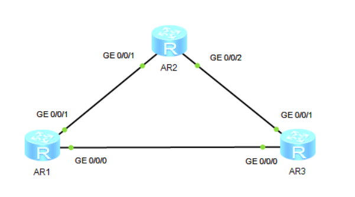

### *сделано вместе с https://github.com/Speedwag00n*

# Лабораторная работа №2: Создание взаимосвязанной IP-сети

## Адресация и маршрутизация IPv4

**О лабораторной работе**

IPv4 является четвёртой версией интернет-протокола (IP). Это основной протокол из набора протоколов TCP/IP, которой работает на уровне Интернета в модели TCP/IP или на сетевом уровне в модели OSI. Сетевой уровень обеспечивает передачу данных без установления соединения. Каждая IP-дейтаграмма передаётся независимо, что устраняет необходимость устанавливать соединение перед отправкой IP-дейтаграм.

Маршрутизация - основной процесс в сетях передачи данных. Он позволяет выбирать маршруты в сети, по которым пакеты передаются от источника в пункт назначения.

С помощью этой лабораторной работы вы научитесь настраивать адреса IPv4 и статические маршруты IPv4, а также поймете основные принципы маршрутизации.

**Цели**

Лабораторная работы помогает получить практические навыки по изучению следующих тем:

- Процедура настройки IPv4-адреса на интерфейсе
- Функция и значение loopback-интерфейсов
- Принципы генерирования прямых маршрутов
- Процедура настройки статических маршрутов и условия, при которых используются статические маршруты
- Процедура проверки возможности установления соединения сетевого уровня с помощью инструмента ping
- Процедура настройки статических маршрутов и сценарии и применения

**Топология сети**

Маршрутизаторы R1, R2 и R3 являются шлюзами определённых сетей. Для подключения к этим сетям необходимо настроить шлюзы.

**План работы**

1. Настройка IP-адресов для интерфейсов на маршрутизаторах.
2, Настройка статических маршрутов для установления свзяи между маршрутизаторами.

## Маршрутизация OSPF

**О лабораторной работе**

Протокол OSPF (Open Shortest Path First) представляет собой протокол внутреннего шлюза (Interior Gateway Protocol, IGP), разработанный сообществом IETF. Он основан на технологии отслеживания состояния канала (link-state). В настоящее время в сетях IPv4 используется OSPF версии 2 (RFC 2328). Как протокол динамической маршрутизации, основанный на технологии отслеживания состояния каналов, OSPF имеет следующие преимущества:

- Многоадресная передача для снижения нагрузки на коммутаторы, на которых не работает OSPF
- Бесклассовая междоменная маршрутизации (Classless Inter-Domain Routing, CIDR)
- Балансировка нагрузки между равноценным маршрутами
- Пакетная аутентификация

Благодаря перечисленным выше преимуществам OSPF широко применяется используется в качестве IGP.

В ходе лабораторной работы вы выполните настройку OSPF для одной области, что позволит вам понять принцип действия OSPF и изучить основные конфигурации.

Лабораторная работа помогает получить практические навыки по изучение следующих тем:

- Основные команды OSPF
- Процедура проверки рабочего статуса OSPF
- Процедура настройки выбора маршрутизации OSPF на основании их стоимости
- Анонсированием маршрутов по умолчанию OSPF
- Процедура настройки аутентификации в OSPF

**Топологии сети**

Аналогична заданию 1

**План работы***

1. Создание процессов OSPF на устройствах и включение OSPF на интерфейсах.
2. Настройка аутентификации OSPF.
3. Настройка OSPF для анонсирования маршрутов по умолчанию.
4. Управление выбором маршрутов OSPF на основании их стоимости.