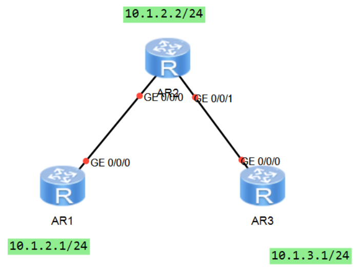

### *сделано вместе с https://github.com/Speedwag00n*

# Лабораторная работа №2: Создание взаимосвязанной IP-сети

## Адресация и маршрутизация IPv4

**О лабораторной работе**

IPv4 является четвёртой версией интернет-протокола (IP). Это основной протокол из набора протоколов TCP/IP, которой работает на уровне Интернета в модели TCP/IP или на сетевом уровне в модели OSI. Сетевой уровень обеспечивает передачу данных без установления соединения. Каждая IP-дейтаграмма передаётся независимо, что устраняет необходимость устанавливать соединение перед отправкой IP-дейтаграм.

Маршрутизация - основной процесс в сетях передачи данных. Он позволяет выбирать маршруты в сети, по которым пакеты передаются от источника в пункт назначения.

С помощью этой лабораторной работы вы научитесь настраивать адреса IPv4 и статические маршруты IPv4, а также поймете основные принципы маршрутизации.

**Цели**

Лабораторная работы помогает получить практические навыки по изучению следующих тем:

- Процедура настройки IPv4-адреса на интерфейсе
- Функция и значение loopback-интерфейсов
- Принципы генерирования прямых маршрутов
- Процедура настройки статических маршрутов и условия, при которых используются статические маршруты
- Процедура проверки возможности установления соединения сетевого уровня с помощью инструмента ping
- Процедура настройки статических маршрутов и сценарии и применения

**Топология сети**

Маршрутизаторы R1, R2 и R3 являются шлюзами определённых сетей. Для подключения к этим сетям необходимо настроить шлюзы.

**План работы**

1. Настройка IP-адресов для интерфейсов на маршрутизаторах.
2, Настройка статичеvских маршрутов для установления свзяи между маршрутизаторами.

## Маршрутизация OSPF

**О лабораторной работе**

Протокол OSPF (Open Shortest Path First) представляет собой протокол внутреннего шлюза (Interior Gateway Protocol, IGP), разработанный сообществом IETF. Он основан на технологии отслеживания состояния канала (link-state). В настоящее время в сетях IPv4 используется OSPF версии 2 (RFC 2328). Как протокол динамической маршрутизации, основанный на технологии отслеживания состояния каналов, OSPF имеет следующие преимущества:

- Многоадресная передача для снижения нагрузки на коммутаторы, на которых не работает OSPF
- Бесклассовая междоменная маршрутизации (Classless Inter-Domain Routing, CIDR)
- Балансировка нагрузки между равноценным маршрутами
- Пакетная аутентификация

Благодаря перечисленным выше преимуществам OSPF широко применяется используется в качестве IGP.

В ходе лабораторной работы вы выполните настройку OSPF для одной области, что позволит вам понять принцип действия OSPF и изучить основные конфигурации.

Лабораторная работа помогает получить практические навыки по изучение следующих тем:

- Основные команды OSPF
- Процедура проверки рабочего статуса OSPF
- Процедура настройки выбора маршрутизации OSPF на основании их стоимости
- Анонсированием маршрутов по умолчанию OSPF
- Процедура настройки аутентификации в OSPF

**Топологии сети**

Аналогична заданию 1

**План работы***

1. Создание процессов OSPF на устройствах и включение OSPF на интерфейсах.
2. Настройка аутентификации OSPF.
3. Настройка OSPF для анонсирования маршрутов по умолчанию.
4. Управление выбором маршрутов OSPF на основании их стоимости.

# Лабораторная работа №3: Создание коммутируемой сети Ethernet

## Основы Ethernet и конфигурирования VLAN

**О лабораторной работе**

В сетях Ethernet исползуется метод доступа к общей среде передачи данных, называемый методом множественного доступа с контролем несущей и обнаружением коллизий (Carrier Sense Multiple Access/Collision Detection, CSMA/CD). При наличии в сети Ethernet большого количества хостов коллизии становятся серьёзной проблемой, приводящей к широковещательных штормам. Это снижает производительность сети или даже может полностью вывести из строя. Использование коммутаторов для подключения к локальным сетям (LAN) позволяет сократить число коллизий, но широковещательная передача по-прежнему может создавать проблемы. 

Для подавления широковещательных штормов используется технология VLAN, которая позволяет разделить физическую локальную сеть (LAN) на несколько виртуальных локальных сетей (VLAN), чтобы широковещательные домены были меньше. Хосты внутри VLAN могут напрямую взаимодействовать только с хостами той же VLAN. А их связь с хостами в других VLAN реализуется через маршрутизатор.

С помощью этой лабораторной работы вы узнаете, как настроить VLAN на коммутаторах Huawei.

**Цели**

Лабораторная работы помогает получить практические навыки по изучению следующих тем:
- Создание VLAN
- Конфигурирование портов доступа, магистральных портов и гибридных портов
- Конфигурирование VLAN на основе портов
- Конфигурирование VLAN на основе MAC-адресов
- Просмотр таблицы MAC-адресов и информацию о VLAN

**Топология сети**

Компании необходимо разделить сеть уровня 2 на несколько VLAN для удовлетворения служебных требований. Кроме того, VLAN 10 должна обеспечивать более высокий уровень безопасности, поэтому в неё можно добавить только специальные ПК.

Для этого пользовательские порты идентичных служб на S1 и S2 необходимо назначить в одну и ту же VLAN, а порты с определенными MAC-адрессами на S2 - в другую VLAN.

**План работы**

1. Создание VLAN.
2. Конфигурирование VLAN на основе портов.
2. Конфигурирование VLAN на основе MAC-адресов.

# Лабораторная работа №4: Основы сетевой безопасности и доступа к сети

## Настройка ACL

**О лабораторной работе**

Список контоля доступа (Access Control List, ACL) - это набор правил, разрещающих или запрещающих доступ. В каждом правиле определяется условие сопоставления пакетов. Это может быть адрес источника, адрес пункта назначения или номер порта.

ACL - это механизм фильтрации пакетов на основе правил. Пакеты, соответствующие списку ACL, обрабатываются на основе политики, определенной в ACL.

**Цели**

Лабораторная работа помогает получить практические навыки по изучению следующих тем:

- Настройка списков ACL
- Применение ACL на интерфейсе
- Основное методы фильтрации трафика

**Топология сети**

В сети, показанной на схеме, маршрутизатор R3 выполняет функции сервера, маршрутизатор R1 выполняет функции клиента, и они доступны для связи. Физические интерфейсы, соединяющие R1 и R2, имеют IP-адреса 10.1.2.1/24 и 10.1.2.2/24 соответственно, а физические интерфейсы, соединяющие R2 и R3, - IP-адреса 10.1.3.2/24 и 10.1.3.1/24. Кроме того, на маршрутизаторе R1 созданы два логических интерфейса LoopBack 0 и LoopBack 1 для имитации двух пользователей-клиентов. Два интерфейса имеют IP-адреса 10.1.1.1/24 и 10.1.4.1/24 соответственно.

Один пользователь (LoopBack 1 на R1) должен удалённо управлять R3. Для гарантии того, что вход в R3 будет разрешён только пользователю, который соответствует политике безопасности, можно настроить Telnet на сервере, задать защиту паролем и сконфигурировать ACL.

**План работы**

1. Настройка IP-адресов.
2. Настройка OSPF для обеспечения возможности сетевого подключения.
3. Создание ACL на основе необходимого трафика.
4. Настройка фильтрации трафика.

# Лабораторная работа №5: Конфигурирование основных сетевых служб

## Настройка FTP

**О лабораторной работе**

Для управления файлами используются несколько режимов, включая протокол передачи файлов (File Transfer Protocol, FTP), простейший протокол передачи файлов (Trivial File Transfer Protocol, TFTP) и безопасный протокол передачи файлов (Secure File Transfer Protocol, SFTP). Вам необходимо выбрать один, исходя из требований к обслуживанию к безопасности.

Устройство может работать как сервер или как клиент.

- Если устройство выполняет функции сервера, то для управления файлами можно получить к нему доступ с клиента и передавать файлы между клиентов и устройством.
- Если устройство работает как клиент, то для управления и передачи файлов можно получить доступ к другому устройству (серверу) с устройства.

**Цели**

Лабораторная работа помогает получить практические навыки по изучению следующих тем:

- Установление FTP-соединения
- Настройка параметров FTP-сервера
- Процедура передачи файлов на FTP-сервер

**Топология сети**

Необходимо на R1 выполнять операции с конфигурационным файлом R2. R1 функционирует как FTP-клиент, а R2 - как FTP-сервер.

**План работы**

1. Настройка функции и параметров FTP-сервера.
2. Настройка локальных пользователей FTP.
3. Вход в систему FTP-сервера с FTP-клиента.
4. Выполнение операции с файлами в FTP-клиенте.

# Лабораторная работа №6: Создание WLAN

**О лабораторной работе**

К основным недостаткам проводных локальных сетей можно отнести дороговизну создания и расширения, а также отсутствие мобильности сетевых устройств. Чтобы удовлетворить растущий спрос на портативность и мобильность устройств, необходимо использовать технологии беспроводной локальной сети (WLAN). В настоящее время WLAN является наиболее экономичным и удобным режимом сетевого доступа. Технология WLAN обеспечивает пользователям возможность свободного перемещения в зоне её покрытия, устраняя ограничения проводных сетей.

В этой лабораторной работе вы научитесь конфигурировать WLAN с помощью  контроллера доступа (AC) и точек доступа Fit AP.

**Цели**

Лабораторная работа помогает получить практические навыки по изучению следующих тем:

- Процедура аутентификации точек доступа
- Процедура настройки профилей WLAN
- Процесс настрйоки основных параметров WLAN

**Топология сети**

1. Коммутатор S2 должен поддерживать функцию WLAN-AC. Если коммутатор не поддерживает функцию WLAN-AC, то вместо него можно использовать обычный контроллер доступа (AC). В данном случае функции AC выполняет коммутатор S2.
2. AC развёрнут в режиме "Out-of-path" (вне пути прохождения трафика) и находится в той же сети уровня 2, что и точки доступа (AP).
3. AC и S1 работают как DHCP-серверы. AC назначает IP-адреса AP, а S1 назначает IP-адреса станциям (STA).
4. Служебные данные передаются напрямую.

**План работы**

1. Настройка подключения к проводной сети.
2. Настройка точек доступа и перевод их в режим онлайн.
    - Создание групп точек доступа и добавление точек доступа с одинаковой конфигурацией в одну группу для унифицированной настройки.
    - Настройка системных параметров контроллера доступа, включая код страны и интерфейс-источник, используемый контроллером для связи с точками доступа.
    - Настройка режима аутентификации AP и импорт AP для выхода точек доступа в сеть.
3. Настройка параметров сервисов WLAN и передача конфигурации точкам доступа, чтобы обеспечить доступ STA к WLAN.